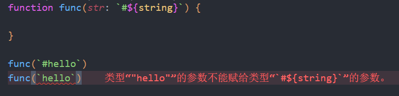

在 `typescript` 中除了 `javascript` 的数据类型之外, 还有一些便于 **推导** 的类型。

# 类型

## 元组(Tuple)

元素个数和类型固定的数组类型

```typescript
type aaa = [number, string];

let a: aaa;
a = [1,'a']
a = [123,'asd',22]
```


## 接口(Interface)

描述函数、对象、构造器的结构

> 但一般函数就直接跟着写在后面而没有重新命名了

## 枚举(Enum)

```typescript
enum Transpiler {
    Babel = 'babel',
    Postcss = 'postcss',
    Terser = 'terser',
    Prettier = 'prettier',
    TypeScriptCompiler = 'tsc'
}

const transpiler = Transpiler.TypeScriptCompiler;
```

同时在 `typescript` 中还支持**字面量**作为类型,而且也可以通过**模板字符串**来规定字符串格式


## 其他类型
- `never` 代表不可达,比如函数抛异常的时候,返回值就是 `never`。
- `void` 代表空,可以是 `undefined` 或 `never`。
- `any` 是任意类型,任何类型都可以赋值给它,它也可以赋值给任何类型(除了 `never`)。
- `unknown` 是未知类型,任何类型都可以赋值给它,但是它不可以赋值给别的类型。