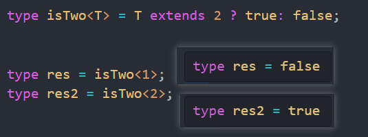
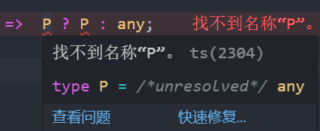

## 条件判断(extends ? :)

这个运算有点像三元运算符 `if xxx ? res1 : res2` 不过它支持多条件判断，并且是惰性求值。

```typescript
type isTwo<T> = T extends 2 ? true: false;

type res = isTwo<1>;
type res2 = isTwo<2>;
```



## 推导(infer)

有点像假设条件, 如果某个条件满足, 先假设其中某个变量的类型为 `T`, 然后进行推导

```typescript
type ReturnType<T> = T extends (...args: any[]) => infer P ? P : any;
```

> 如果参数是函数, 先假设返回值类型为 `P`, 然后进行推导

如果不加 `infer` 关键字, 就会出现找不到名称 `P` 的错误



## 联合(|)

与二进制运算中的**或运算**相似, 符合其中某个类型即可

```typescript
type Union = 1 | 2 | 3;
```

## 交叉(&)

与二进制运算中的**与运算**相似, 符合所有类型即可

```typescript
type Intersection = 1 & 2 & 3;
```

## 映射类型(keyof)

映射类型可以遍历某个类型的所有属性, 返回一个联合类型

```typescript
type Props = {
  name: string;
  age: number;
};

type Keys = keyof Props; // "name" | "age"
```
